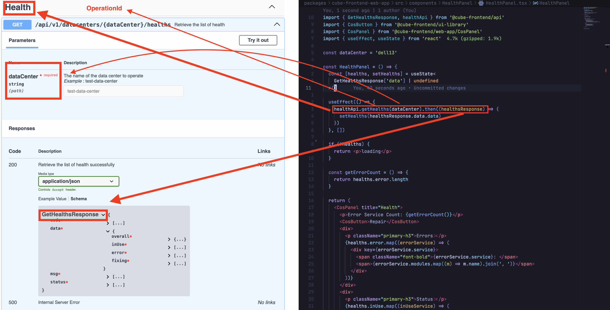

# COS API Typescript SDK

This package generates a Typescript API SDK from [cube-cos-openapi](https://github.com/bigstack-oss/cube-cos-openapi) using [openapi-generator](https://github.com/OpenAPITools/openapi-generator).

## Prerequisites

Install [Docker Desktop](https://www.docker.com/products/docker-desktop/) on your develop machine and ensure it is running.

## Git Submodule

Use [git submodule](https://git-scm.com/book/en/v2/Git-Tools-Submodules) to ensure that the SDK is generated using the correct version of [cube-cos-openapi](https://github.com/bigstack-oss/cube-cos-openapi).

## Validate COS OpenAPI

You should validate the OpenAPI syntax before committing changes in `./cube-cos-openapi`:

```sh
# In `packages/cube-frontend-api` folder:
pnpm run validate

# In root folder:
pnpm run api:validate
```

## Generate Typescript SDK

You should generate the SDK after updating the `./cube-cos-openapi` submodule:

```sh
# In `packages/cube-frontend-api` folder:
pnpm run generate

# In root folder:
pnpm run api:generate
```

## How to Use


