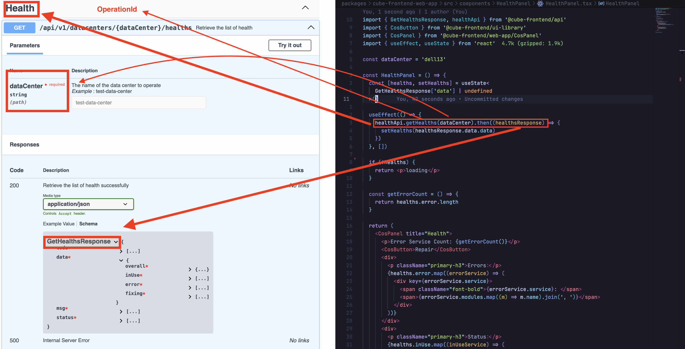

# COS API Typescript SDK

This package generates a Typescript API SDK from [cube-cos-openapi](https://github.com/bigstack-oss/cube-cos-openapi) using [openapi-generator](https://github.com/OpenAPITools/openapi-generator).

## Prerequisites

Install [Docker Desktop](https://www.docker.com/products/docker-desktop/) on your develop machine and ensure it is running.

## Git Submodule

Use [git submodule](https://git-scm.com/book/en/v2/Git-Tools-Submodules) to ensure that the SDK is generated using the correct version of [cube-cos-openapi](https://github.com/bigstack-oss/cube-cos-openapi).

### First-Time Setup

1. **Set up your SSH Public Key**:  
   Ensure you have configured your [SSH Public Key](https://git-scm.com/book/en/v2/Git-on-the-Server-Generating-Your-SSH-Public-Key) for authentication.

2. **Initialize and update submodules**:  
   Run the following command to clone and initialize all submodules:

   ```bash
   git submodule update --init --recursive
   ```

### Update API TypeScript SDK Version

Follow these steps to update the API version:

1. Get the target commit hash from the `cube-cos-openapi` repository. For example, `d4151bd`.
2. Navigate to the submodule directory (`cd packages/cube-frontend-api/cube-cos-openapi`) and run `git checkout d4151bd`. Replace `d4151bd` with your actual commit hash.
3. After switching to the target commit, you'll see that the file `packages/cube-frontend-api/cube-cos-openapi.diff` has changed. You should **commit this change to the remote**.
4. Run `pnpm api:generate` at the project root, and the API SDK should be generated based on the OpenAPI docs of the target branch.

### Updating Submodules

For future updates (e.g., after switching to a different branch), run:

```bash
git submodule update --recursive
```

## Generate Typescript SDK

You should generate the SDK after updating the `./cube-cos-openapi` submodule:

```sh
# In `packages/cube-frontend-api` folder:
pnpm run generate

# In root folder:
pnpm run api:generate
```

## The `sdk` Folder

The `sdk` folder contains files generated by [openapi-generator](https://github.com/OpenAPITools/openapi-generator/tree/master) using the TypeScript + Axios template. These files are auto-generated and should not be manually modified. To update them, use the `generate` command as described above.

## How to Use


