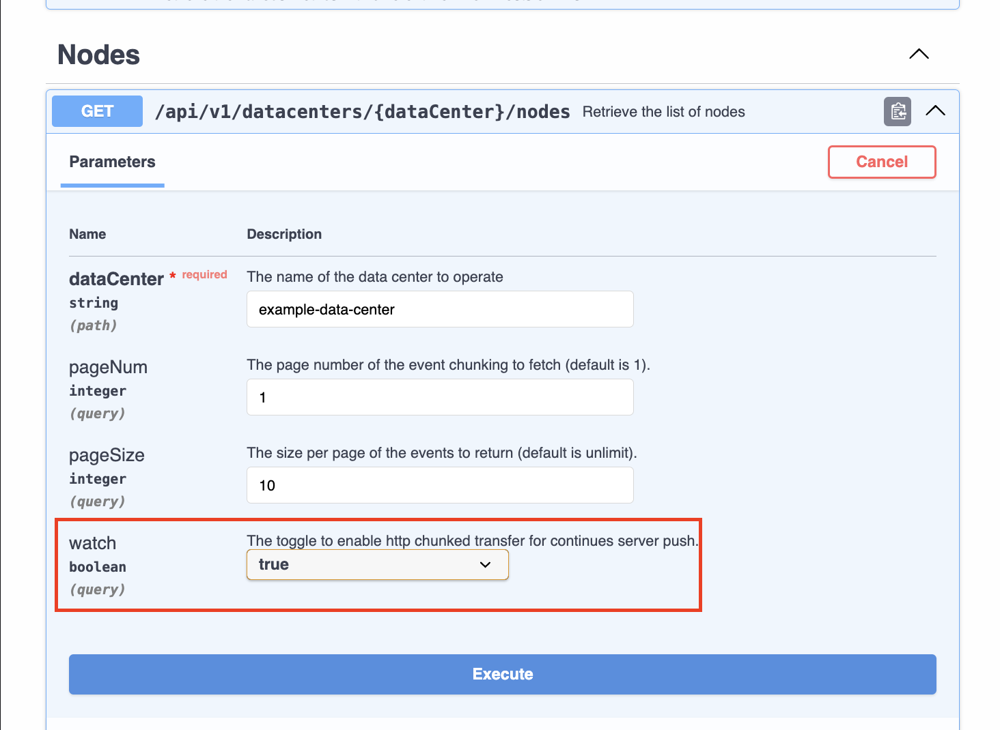

# COS API Request Hooks

To make response handling (e.g., error message parsing) more consistent across the application, we’ve introduced two hooks: [`useCosGetRequest`](#usecosgetrequest) and [`useCosMutationRequest`](#usecosmutationrequest).

## `useCosGetRequest`

`useCosGetRequest` is designed for managing HTTP GET requests from our API server.

### Get Requests Without Parameters

```ts
const {
  isLoading,
  data: bars,
  getResource: getBars,
  errorState,
} = useCosGetRequest(fooApi.getBars)
```

You can call `getBars` to manually trigger the request when necessary:

```ts
const myFunction = async () => {
  const bars = await getBars()
}
```

### Get Requests With Parameters

```ts
const {
  isLoading,
  data: bars,
  getResource: getBars,
  errorState,
} = useCosGetRequest(fooApi.getBars, () => {
  if (shouldNotFetch) {
    // Returns `null` or `undefined` to prevent the hook from sending
    // a request with nullish parameter.
    return null
  }
  const req: GetBarsRequest = {
    // ...
  }
  return req
})
```

#### Get Requests With Parameters and Axios Request Config

```ts
const {
  isLoading,
  data: bars,
  getResource: getBars,
  errorState,
} = useCosGetRequest(
  (params) => {
    const { req, options } = params
    return fooApi.getBars(req, options)
  },
  () => {
    if (shouldNotFetch) {
      // Returns `null` or `undefined` to prevent the hook from sending
      // a request with nullish parameter.
      return null
    }
    const req: GetBarsRequest = {
      // ...
    }
    const options: RawAxiosRequestConfig = {
      // ...
    }
    return { req, options }
  },
)
```

## `useCosStreamRequest`

This hook is designed for real-time scenarios, such as Dashboards or Monitoring systems.

Some COS APIs (which have the `watch` option in the request query) support the stream method to continuously push real-time data or send updates at regular intervals.



The `useCosStreamRequest` hook automatically includes the query `?watch=true` in your request and handle response chunks correctly.

### Stream Requests With Parameters

```ts
const {
  // True before the first response chunk received.
  isLoading,
  // `data` is updated when the server pushes a new response chunk.
  data: bars,
  errorState,
  // Ensure that `fooApi.getBar` supports the watch query option.
} = useCosStreamRequest(fooApi.getBars, () => {
  if (shouldNotFetch) {
    // Returns `null` or `undefined` to prevent the hook from sending
    // a request with nullish parameter.
    return null
  }
  const req: GetBarsRequest = {
    // ...
  }
  return req
})
```

## `useCosMutationRequest`

`useCosMutationRequest` is designed for managing non-GET requests from our API server, such as POST, PUT, and DELETE.

### Mutation Request Without Parameters

```ts
const {
  isLoading,
  data: bar,
  mutateResource: updateBar,
  errorState,
} = useCosMutationRequest(fooApi.updateBar)

const onClick = async () => {
  try {
    await updateBar()
  } catch (error) {
    if (isCosRequestError(error)) {
      const { nativeError, apiError } = error
      // Do extra error handling if necessary.
    }
  }
}
```

### Mutation Request With Parameters and Axios Request Config

```ts
const {
  isLoading,
  data: bar,
  mutateResource: createBar,
  errorState,
} = useCosMutationRequest(fooApi.createBar)

const onClick = async () => {
  try {
    const req: CreateBarsRequest = {
      // ...
    }
    const options: RawAxiosRequestConfig = {
      // ...
    }

    // Immediately retrieve the response returned by the API if necessary.
    const bar = await createBar(req, options) // `options` is optional.
    console.log(bar)
  } catch (error) {
    if (isCosRequestError(error)) {
      const { nativeError, apiError } = error
      // Do extra error handling if necessary.
    }
  }
}
```

## Displaying Error Messages

TODO: Implement a component display request error consistently.
